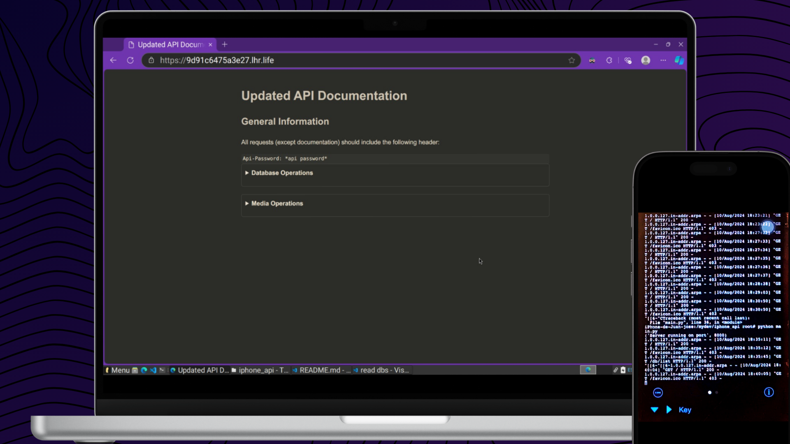

# Simple API Project on an Old iPhone 4

This project is a simple API running on an old iPhone 4s!.
The API is built with Python 2.5 and provides basic CRUD operations for databases, media services, and SQL query endpoints. Below, you'll find detailed documentation for using the API.

## Core Features
- **CRUD Operations:** Provides basic Create, Read, Update, and Delete operations for database management.
- **Media Services:** Handles media file uploads, downloads, and deletions.
- **SQL Query Endpoints:** Allows execution of SQL queries on the database.
- **Authentication:** Ensures secure access to API endpoints using a `Code` header.

## Project Overview

This project demonstrates the capability to run a web server and handle API requests on outdated hardware. It utilizes SQLite as the database engine and serves media files from dedicated folders. The api is deployed thanks to localhost.run

## API Documentation

You can see the documentation in the root of the api